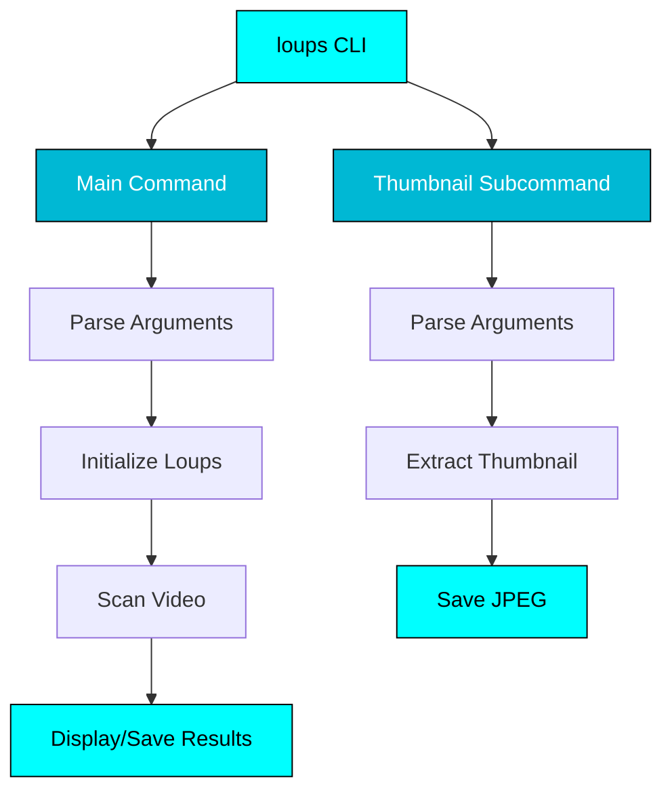

# :material-console-line: CLI Module

Command-line interface implementation using Typer and Rich.

---

## :book: Module Documentation

::: loups.cli
    options:
      show_root_heading: true
      show_source: true
      heading_level: 3
      members_order: source
      show_signature_annotations: true
      separate_signature: true

---

## :gear: CLI Architecture

The Loups CLI is built with:

- **[Typer](https://typer.tiangolo.com/)** - Modern CLI framework
- **[Rich](https://rich.readthedocs.io/)** - Beautiful terminal output
- **Subcommands** - Main command + thumbnail extraction



---

## :wrench: Customizing the CLI

### Extending Commands

You can build on top of the Loups CLI:

```python
from loups.cli import app
import typer

@app.command()
def batch(
    directory: str = typer.Argument(..., help="Directory with videos"),
    template: str = typer.Option(None, "-t", "--template")
):
    """Process all videos in a directory."""
    from pathlib import Path
    from loups import Loups

    video_dir = Path(directory)

    for video in video_dir.glob("*.mp4"):
        print(f"Processing {video.name}...")

        loups = Loups(
            video_path=str(video),
            template_path=template
        )

        chapters = loups.scan()

        # Save output
        output = video.with_suffix(".txt")
        with open(output, "w") as f:
            for ch in chapters:
                f.write(f"{ch.timestamp} {ch.title}\n")

if __name__ == "__main__":
    app()
```

### Custom Progress Display

Replace the default progress bar:

```python
from loups import Loups
from rich.progress import Progress, SpinnerColumn, TextColumn

class CustomLoups(Loups):
    def scan(self):
        with Progress(
            SpinnerColumn(),
            TextColumn("[progress.description]{task.description}"),
            transient=True
        ) as progress:
            task = progress.add_task("Scanning...", total=None)

            # Your custom processing
            results = super().scan()

            progress.update(task, completed=True)
            return results
```

---

## :art: Output Formatting

### Custom Chapter Format

```python
from loups import Loups

loups = Loups("video.mp4", "template.png")
chapters = loups.scan()

# Custom format
for i, ch in enumerate(chapters, 1):
    print(f"{i}. [{ch.timestamp}] {ch.title}")

# JSON format
import json
output = json.dumps([
    {"time": ch.timestamp, "title": ch.title}
    for ch in chapters
], indent=2)
print(output)

# Markdown format
print("## Chapters\n")
for ch in chapters:
    print(f"- **{ch.timestamp}** - {ch.title}")
```

---

## :robot: Automation Examples

### Shell Script Integration

```bash
#!/bin/bash
# process_videos.sh

for video in videos/*.mp4; do
  echo "Processing: $video"

  # Run Loups
  loups -q -o "${video%.mp4}.txt" "$video"

  # Check exit code
  if [ $? -eq 0 ]; then
    echo "✅ Success: $video"
  else
    echo "❌ Failed: $video"
  fi
done
```

### Python Automation

```python
import subprocess
from pathlib import Path

videos = Path("videos").glob("*.mp4")

for video in videos:
    output = video.with_suffix(".txt")

    # Run Loups CLI
    result = subprocess.run([
        "loups",
        "-q",
        "-o", str(output),
        str(video)
    ], capture_output=True, text=True)

    if result.returncode == 0:
        print(f"✅ {video.name}")
    else:
        print(f"❌ {video.name}: {result.stderr}")
```

---

## :construction: CLI Development

### Running from Source

```bash
# Install in development mode
pip install -e .

# Or use Python module
python -m loups.cli --help
```

### Testing CLI Commands

```python
from typer.testing import CliRunner
from loups.cli import app

runner = CliRunner()

def test_main_command():
    result = runner.invoke(app, ["--help"])
    assert result.exit_code == 0
    assert "video" in result.stdout.lower()

def test_thumbnail_command():
    result = runner.invoke(app, [
        "test.mp4",
        "thumbnail",
        "--thumbnail-output", "thumb.jpg"
    ])
    assert result.exit_code == 0
```

---

## :material-format-list-bulleted: Command Reference

For complete CLI usage documentation, see:

- [:material-console: CLI Reference](../user-guide/cli-reference.md) - All command options
- [:material-rocket-launch: Quick Start](../user-guide/quick-start.md) - Usage examples

---

## :link: Related

- [:material-package-variant: Loups Class](loups.md) - Core Python API
- [:material-image-frame: Thumbnail Extraction](thumbnail.md) - Thumbnail API
- [:material-console: CLI Reference Guide](../user-guide/cli-reference.md) - User documentation
