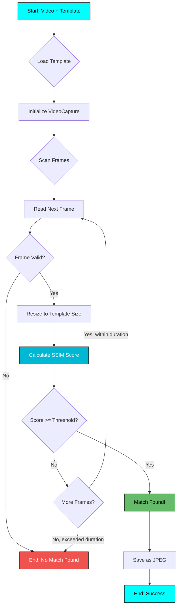

# :material-image-frame: Thumbnail Extraction

SSIM-based thumbnail matching and extraction API.

---

## :book: Module Documentation

::: loups.thumbnail_extractor
    options:
      show_root_heading: true
      show_source: true
      heading_level: 3
      members_order: source
      show_signature_annotations: true
      separate_signature: true

---

## :material-flow-chart: Extraction Process



**Key Steps:**

1. **Template Loading** - Load and validate template image
2. **Frame Scanning** - Iterate through video frames at specified FPS
3. **SSIM Calculation** - Compute Structural Similarity Index
4. **Threshold Check** - Compare against minimum threshold
5. **First-Match Strategy** - Stop immediately on first match
6. **Save Output** - Write matched frame as JPEG

---

## :zap: Usage Examples

### Basic Extraction

```python
from loups.thumbnail_extractor import extract_thumbnail

# Extract with default template
thumbnail_path = extract_thumbnail(
    video_path="game_video.mp4"
)

print(f"Thumbnail saved to: {thumbnail_path}")
```

### Custom Template

```python
from loups.thumbnail_extractor import extract_thumbnail

thumbnail_path = extract_thumbnail(
    video_path="video.mp4",
    template_path="title_screen_template.png",
    output_path="custom_thumbnail.jpg"
)
```

### Fine-Tuned Extraction

```python
from loups.thumbnail_extractor import extract_thumbnail

thumbnail_path = extract_thumbnail(
    video_path="video.mp4",
    template_path="template.png",
    output_path="thumb.jpg",
    threshold=0.7,           # Stricter matching (default: 0.35)
    scan_duration=180,       # Scan first 3 minutes (default: 120)
    frames_per_second=5,     # Sample 5 FPS (default: 3)
    quiet=False              # Show progress
)
```

---

## :material-tune: Parameters Explained

### Threshold (0.0 - 1.0)

The **SSIM threshold** determines how similar a frame must be to the template:

| Threshold | Matching Behavior | Use Case |
|-----------|------------------|----------|
| `0.2 - 0.4` | :material-check-all: **Loose** - More matches | Varied title screens |
| `0.5 - 0.7` | :material-check: **Balanced** - Moderate | Most use cases |
| `0.8 - 1.0` | :material-alert: **Strict** - Exact match | Identical frames only |

**Default:** `0.35` (loose, good for varied content)

!!! tip "Finding the Right Threshold"
    Start with default (0.35) and adjust:

    - **Too many false positives?** → Increase threshold
    - **Can't find match?** → Decrease threshold
    - **Test on sample** to find sweet spot

### Scan Duration

How many seconds to scan from the beginning:

```python
# Scan first 2 minutes
extract_thumbnail(video_path="video.mp4", scan_duration=120)

# Scan first 5 minutes
extract_thumbnail(video_path="video.mp4", scan_duration=300)

# Scan entire video (slow!)
extract_thumbnail(video_path="video.mp4", scan_duration=999999)
```

!!! warning "Performance Impact"
    Longer scan duration = slower extraction. Most title screens appear in first 2 minutes.

### Frames Per Second

Frame sampling rate:

```python
# Sample every frame (slow, thorough)
extract_thumbnail(video_path="video.mp4", frames_per_second=30)

# Sample 3 FPS (default, balanced)
extract_thumbnail(video_path="video.mp4", frames_per_second=3)

# Sample 1 FPS (fast, might miss frame)
extract_thumbnail(video_path="video.mp4", frames_per_second=1)
```

**Trade-off:** Higher FPS = more accurate but slower

---

## :material-speedometer: SSIM vs Template Matching

Loups uses **SSIM** (Structural Similarity Index) for thumbnails instead of template matching:

| Feature | Template Matching | SSIM |
|---------|------------------|------|
| **Purpose** | Find specific regions | Compare full frames |
| **Speed** | :material-check: Fast | :material-minus: Moderate |
| **Accuracy** | :material-check: High for patterns | :material-check: High for images |
| **Use Case** | Chapter detection | Thumbnail extraction |
| **Sensitivity** | Position-sensitive | Content-aware |

**Why SSIM for thumbnails?**

- :material-check: Accounts for overall visual similarity
- :material-check: Robust to minor variations
- :material-check: Good for comparing full frames
- :material-check: Perceptually meaningful

---

## :material-test-tube: Testing & Debugging

### Verify Template Quality

```python
import cv2
from skimage.metrics import structural_similarity as ssim

# Load template and test frame
template = cv2.imread("template.png")
test_frame = cv2.imread("test_frame.png")

# Resize to same size
test_frame_resized = cv2.resize(
    test_frame,
    (template.shape[1], template.shape[0])
)

# Calculate SSIM
score = ssim(template, test_frame_resized, multichannel=True)
print(f"SSIM Score: {score:.3f}")

# Interpretation
if score >= 0.7:
    print("✅ Strong match")
elif score >= 0.4:
    print("⚠️ Moderate match")
else:
    print("❌ Poor match")
```

### Extract Multiple Frames

For testing, you might want to extract multiple frames:

```python
import cv2
from pathlib import Path

def extract_frames(video_path, output_dir, fps=1, duration=120):
    """Extract frames for template testing."""
    output_dir = Path(output_dir)
    output_dir.mkdir(exist_ok=True)

    cap = cv2.VideoCapture(video_path)
    video_fps = cap.get(cv2.CAP_PROP_FPS)
    frame_interval = int(video_fps / fps)

    frame_count = 0
    saved_count = 0

    while frame_count < (duration * video_fps):
        ret, frame = cap.read()
        if not ret:
            break

        if frame_count % frame_interval == 0:
            output_path = output_dir / f"frame_{saved_count:04d}.jpg"
            cv2.imwrite(str(output_path), frame)
            saved_count += 1

        frame_count += 1

    cap.release()
    print(f"Extracted {saved_count} frames to {output_dir}")

# Usage
extract_frames("video.mp4", "test_frames", fps=1, duration=60)
```

---

## :material-image-multiple: Batch Thumbnail Extraction

### Process Multiple Videos

```python
from pathlib import Path
from loups.thumbnail_extractor import extract_thumbnail

video_dir = Path("videos")
thumb_dir = Path("thumbnails")
thumb_dir.mkdir(exist_ok=True)

for video in video_dir.glob("*.mp4"):
    print(f"Extracting thumbnail for: {video.name}")

    try:
        thumbnail = extract_thumbnail(
            video_path=str(video),
            output_path=str(thumb_dir / f"{video.stem}.jpg"),
            quiet=True
        )
        print(f"  ✅ Saved: {thumbnail}")
    except Exception as e:
        print(f"  ❌ Error: {e}")
```

### Parallel Processing

```python
from concurrent.futures import ThreadPoolExecutor
from pathlib import Path
from loups.thumbnail_extractor import extract_thumbnail

def extract_single(video_path):
    """Extract thumbnail for single video."""
    try:
        output = f"thumbnails/{video_path.stem}.jpg"
        return extract_thumbnail(
            video_path=str(video_path),
            output_path=output,
            quiet=True
        )
    except Exception as e:
        return f"Error: {e}"

# Get all videos
videos = list(Path("videos").glob("*.mp4"))

# Process in parallel
with ThreadPoolExecutor(max_workers=4) as executor:
    results = executor.map(extract_single, videos)

# Print results
for video, result in zip(videos, results):
    print(f"{video.name}: {result}")
```

---

## :bulb: Tips & Best Practices

!!! success "Best Practices"
    - :material-check: **Template from actual frame** - Use a real frame from your video
    - :material-check: **Start with defaults** - Adjust only if needed
    - :material-check: **Test on one video first** - Verify settings work
    - :material-check: **Use quiet mode in scripts** - Cleaner output

!!! warning "Common Issues"
    **No match found?**

    - Try lower threshold (0.2 - 0.3)
    - Increase scan duration
    - Increase frames_per_second
    - Verify template matches video content

    **Wrong frame matched?**

    - Increase threshold for stricter matching
    - Use more specific template
    - Reduce scan duration if title appears early

---

## :link: Related

- [:material-package-variant: Loups Class](loups.md) - Main API
- [:material-console-line: CLI Module](cli.md) - Command-line usage
- [:material-console: CLI Thumbnail Reference](../user-guide/cli-reference.md#thumbnail-command) - User guide
