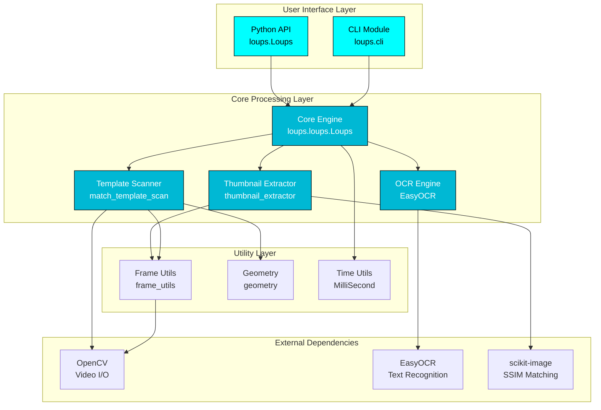
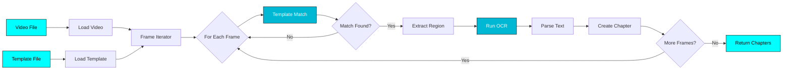
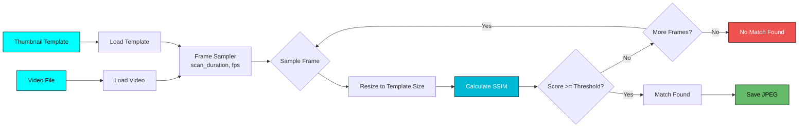

# :material-sitemap: Architecture

System architecture and module design of Loups.

---

## :building_construction: System Overview

Loups is built as a modular Python application with clear separation of concerns:



---

## :package: Module Breakdown

### User Interface Layer

#### CLI Module (`loups.cli`)

**Purpose:** Command-line interface using Typer and Rich

**Responsibilities:**
- :material-check: Parse command-line arguments
- :material-check: Display rich progress bars and output
- :material-check: Handle user interactions
- :material-check: Route to main command or thumbnail subcommand

**Key Components:**
- `app`: Typer application instance
- `main()`: Main chapter scanning command
- `thumbnail_command()`: Thumbnail extraction subcommand

**Dependencies:**
- Typer (CLI framework)
- Rich (terminal formatting)
- Core Loups engine

#### Python API (`loups.Loups`)

**Purpose:** Programmatic interface for Python developers

**Responsibilities:**
- :material-check: Provide clean Python API
- :material-check: Manage video processing workflow
- :material-check: Return structured chapter data

---

### Core Processing Layer

#### Core Engine (`loups.loups.Loups`)

**Purpose:** Main orchestration class

**Responsibilities:**
- :material-check: Initialize video capture
- :material-check: Coordinate template matching
- :material-check: Manage OCR extraction
- :material-check: Generate chapter timestamps
- :material-check: Handle logging and error management

**Key Methods:**
```python
class Loups:
    def __init__(video_path, template_path, **kwargs)
    def scan() -> List[Chapter]
    def _process_frame(frame_num, frame) -> Optional[Match]
    def _extract_text(frame, match_region) -> str
```

**Data Flow:**
1. Load video and template
2. Scan frames for template matches
3. Extract text from matched regions via OCR
4. Generate timestamped chapters
5. Return structured results

#### Template Scanner (`match_template_scan`)

**Purpose:** OpenCV template matching logic

**Responsibilities:**
- :material-check: Perform template matching on video frames
- :material-check: Calculate match confidence scores
- :material-check: Identify match regions (bounding boxes)
- :material-check: Filter matches by confidence threshold

**Algorithm:**
```python
def match_template(frame, template, threshold=0.8):
    """Match template against frame using cv2.matchTemplate."""
    # Normalize frame and template
    # Perform template matching (TM_CCOEFF_NORMED)
    # Find matches above threshold
    # Return match locations and confidence
```

#### OCR Engine (EasyOCR Integration)

**Purpose:** Text extraction from matched frames

**Responsibilities:**
- :material-check: Initialize EasyOCR reader
- :material-check: Extract text from frame regions
- :material-check: Apply confidence filtering
- :material-check: Sort text left-to-right
- :material-check: Combine into chapter titles

**Configuration:**
- Languages: English (default)
- Confidence threshold: 0.6 (configurable)
- GPU acceleration: Auto-detected

#### Thumbnail Extractor (`thumbnail_extractor`)

**Purpose:** SSIM-based thumbnail extraction

**Responsibilities:**
- :material-check: Load thumbnail template
- :material-check: Scan video frames with SSIM matching
- :material-check: Find first match above threshold
- :material-check: Save matched frame as JPEG

**Algorithm:**
```python
def extract_thumbnail(video_path, template_path, threshold=0.35):
    """Extract thumbnail using SSIM scoring."""
    # Load template
    # Iterate frames (limited by scan_duration)
    # Calculate SSIM for each frame
    # Return first frame above threshold
    # Save as JPEG
```

---

### Utility Layer

#### Frame Utils (`frame_utils`)

**Purpose:** Video frame manipulation utilities

**Functions:**
- `extract_frame(video_path, frame_num)` - Get specific frame
- `get_video_fps(video_path)` - Get video frame rate
- `get_video_duration(video_path)` - Get video length
- `resize_frame(frame, width, height)` - Resize operations

#### Geometry (`geometry`)

**Purpose:** Bounding box and region calculations

**Functions:**
- `calculate_region(match_loc, template_size)` - Compute match region
- `crop_region(frame, region)` - Extract frame region
- `merge_overlapping_regions(regions)` - Combine close matches

#### Time Utils (`MilliSecond`)

**Purpose:** Timestamp formatting

**Class:**
```python
class MilliSecond:
    """Convert milliseconds to YouTube timestamp format."""

    def __init__(ms: int)
    def yt_format() -> str  # Returns "HH:MM:SS" or "MM:SS"
```

---

## :arrows_counterclockwise: Data Flow

### Chapter Scanning Flow



### Thumbnail Extraction Flow



---

## :electric_plug: External Dependencies

### OpenCV (`opencv-python-headless`)

**Usage:**
- Video capture and frame extraction
- Template matching (cv2.matchTemplate)
- Image operations (resize, crop, color conversion)

**Why headless?**
- Smaller package size
- No GUI dependencies needed
- Perfect for server/CLI use

### EasyOCR

**Usage:**
- Optical Character Recognition
- Text detection and extraction
- Confidence scoring

**Features Used:**
- Multi-language support (English by default)
- GPU acceleration when available
- Bounding box detection
- Confidence scores

### scikit-image

**Usage:**
- SSIM (Structural Similarity Index) calculation
- Image comparison for thumbnail matching

**Why SSIM?**
- Perceptually meaningful similarity metric
- Robust to minor variations
- Better than pixel-by-pixel comparison

### Rich

**Usage:**
- Beautiful terminal progress bars
- Colored console output
- Table formatting
- Error display

### Typer

**Usage:**
- CLI framework
- Argument parsing
- Subcommand routing
- Help generation

---

## :gear: Configuration & Settings

### Environment Variables

```python
# Debug mode
LOUPS_DEBUG=1

# Custom OCR languages
LOUPS_OCR_LANG=en,es

# GPU usage
LOUPS_USE_GPU=0  # Disable GPU
```

### Config File Support (Future)

```yaml
# loups.yaml (planned)
defaults:
  threshold: 0.8
  ocr_confidence: 0.6
  log_level: INFO

templates:
  softball: path/to/softball_template.png
  podcast: path/to/podcast_template.png
```

---

## :construction: Design Patterns

### Separation of Concerns

Each module has a single, well-defined responsibility:

- **CLI** - User interaction only
- **Core** - Business logic orchestration
- **Utils** - Reusable helper functions
- **Dependencies** - External library wrappers

### Dependency Injection

```python
class Loups:
    def __init__(
        self,
        video_path: str,
        template_path: str,
        ocr_engine: Optional[OCREngine] = None,  # Injectable
        video_reader: Optional[VideoReader] = None  # Injectable
    ):
        self.ocr_engine = ocr_engine or DefaultOCREngine()
        self.video_reader = video_reader or OpenCVReader(video_path)
```

### Error Handling

Consistent error handling throughout:

```python
try:
    loups = Loups(video_path, template_path)
    chapters = loups.scan()
except FileNotFoundError as e:
    logger.error(f"File not found: {e}")
    raise
except OCRError as e:
    logger.error(f"OCR failed: {e}")
    raise
except Exception as e:
    logger.error(f"Unexpected error: {e}")
    raise
```

---

## :test_tube: Testing Architecture

### Test Structure

```
tests/
├── test_loups.py              # Core Loups class
├── test_cli.py                # CLI commands
├── test_thumbnail.py          # Thumbnail extraction
├── test_match_template.py     # Template matching
├── test_frame_utils.py        # Frame utilities
├── fixtures/                  # Test data
│   ├── test_video.mp4
│   ├── test_template.png
│   └── expected_output.txt
└── conftest.py                # Pytest configuration
```

### Test Categories

| Type | Coverage | Tools |
|------|----------|-------|
| **Unit Tests** | Individual functions | pytest |
| **Integration Tests** | Module interactions | pytest |
| **E2E Tests** | Full workflow | pytest + fixtures |
| **CLI Tests** | Command execution | Typer CliRunner |

---

## :link: Related Documentation

- [:material-cogs: How It Works](how-it-works.md) - Detailed implementation
- [:material-account-group: Contributing](contributing.md) - Contribution guide
- [:material-code-braces: API Reference](../api/index.md) - API documentation
