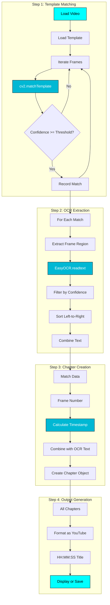

# :material-cogs: How It Works

Deep dive into Loups' video processing pipeline and algorithms.

---

## :material-video: Processing Pipeline

Loups transforms videos into YouTube chapters through a 4-step process:



---

## :one: Step 1: Template Matching

### :mag: What is Template Matching?

Template matching is a computer vision technique that finds regions in an image that match a template image.

**Analogy:** Like using Ctrl+F to find text, but for images!

### :gear: Algorithm Details

Loups uses OpenCV's `cv2.matchTemplate` with the `TM_CCOEFF_NORMED` method:

```python
import cv2
import numpy as np

def match_template(frame: np.ndarray, template: np.ndarray) -> tuple:
    """
    Match template against frame using normalized correlation.

    Args:
        frame: Video frame (BGR image).
        template: Template image to match.

    Returns:
        (best_match_location, confidence_score)
    """
    # Convert to grayscale for faster processing
    frame_gray = cv2.cvtColor(frame, cv2.COLOR_BGR2GRAY)
    template_gray = cv2.cvtColor(template, cv2.COLOR_BGR2GRAY)

    # Perform template matching
    result = cv2.matchTemplate(
        frame_gray,
        template_gray,
        cv2.TM_CCOEFF_NORMED
    )

    # Find best match
    min_val, max_val, min_loc, max_loc = cv2.minMaxLoc(result)

    # TM_CCOEFF_NORMED: higher is better
    confidence = max_val
    location = max_loc

    return location, confidence
```

### :chart_with_upwards_trend: Confidence Scoring

| Score Range | Meaning | Action |
|-------------|---------|--------|
| 0.9 - 1.0 | :material-check-all: Exact match | Always accept |
| 0.7 - 0.9 | :material-check: Strong match | Accept (default threshold: 0.8) |
| 0.5 - 0.7 | :material-minus: Moderate match | Maybe accept (depends on use case) |
| 0.0 - 0.5 | :material-close: Weak match | Reject |

**Default threshold:** `0.8` (strong match required)

### :zap: Frame Iteration Strategy

```python
cap = cv2.VideoCapture(video_path)
fps = cap.get(cv2.CAP_PROP_FPS)
frame_count = 0

while True:
    ret, frame = cap.read()
    if not ret:
        break

    # Check every frame for maximum accuracy
    # (Could skip frames for faster processing)
    location, confidence = match_template(frame, template)

    if confidence >= threshold:
        matches[frame_count] = {
            'location': location,
            'confidence': confidence,
            'timestamp_ms': (frame_count / fps) * 1000
        }

    frame_count += 1

cap.release()
```

### :bulb: Why TM_CCOEFF_NORMED?

OpenCV offers 6 template matching methods. We use `TM_CCOEFF_NORMED` because:

- :material-check: **Normalized** - Scores always 0.0 to 1.0
- :material-check: **Illumination-invariant** - Robust to lighting changes
- :material-check: **Correlation-based** - Measures similarity accurately
- :material-check: **Higher is better** - Intuitive scoring

---

## :two: Step 2: OCR Extraction

### :material-text-recognition: Optical Character Recognition

For each matched frame, we extract text using EasyOCR:

```python
import easyocr

# Initialize reader (done once)
reader = easyocr.Reader(['en'], gpu=True)

def extract_text_from_region(frame: np.ndarray, region: tuple) -> str:
    """
    Extract text from specific frame region.

    Args:
        frame: Full video frame.
        region: (x, y, width, height) bounding box.

    Returns:
        Extracted text string.
    """
    x, y, w, h = region

    # Crop to region of interest
    roi = frame[y:y+h, x:x+w]

    # Run OCR
    results = reader.readtext(roi)

    # Results format: [([box], text, confidence), ...]
    # Filter by confidence and sort left-to-right
    texts = []
    for (box, text, confidence) in results:
        if confidence >= 0.6:  # Confidence threshold
            texts.append((box[0][0], text))  # (x_position, text)

    # Sort by x-position (left to right)
    texts.sort(key=lambda t: t[0])

    # Combine into single string
    return ' '.join([text for _, text in texts])
```

### :dart: Confidence Filtering

OCR results include confidence scores (0.0 to 1.0):

```python
# Example OCR results
[
    ([[10, 20], [100, 20], [100, 50], [10, 50]], "Sarah Johnson", 0.95),
    ([[110, 20], [140, 20], [140, 50], [110, 50]], "#7", 0.92),
    ([[150, 20], [200, 20], [200, 50], [150, 50]], "noise", 0.35),  # Filtered out
]

# After filtering (confidence >= 0.6)
"Sarah Johnson #7"
```

### :arrows_left_right: Left-to-Right Sorting

OCR can return text in any order. We sort by x-coordinate:

```python
def sort_text_left_to_right(ocr_results: list) -> str:
    """Sort OCR results by horizontal position."""
    # Extract x-coordinate from first corner of bounding box
    texts_with_position = [
        (bbox[0][0], text)  # bbox[0][0] is top-left x-coordinate
        for bbox, text, confidence in ocr_results
        if confidence >= 0.6
    ]

    # Sort by x-position
    texts_with_position.sort(key=lambda t: t[0])

    # Return combined text
    return ' '.join([text for _, text in texts_with_position])
```

**Example:**

```
Frame contains:
  [Position 100] "#7"
  [Position 10] "Sarah Johnson"

After sorting:
  "Sarah Johnson #7"  ✅
```

---

## :three: Step 3: Chapter Creation

### :clock: Timestamp Calculation

Convert frame number to YouTube timestamp:

```python
class MilliSecond:
    """Convert milliseconds to YouTube format."""

    def __init__(self, ms: int):
        self.ms = ms

    def yt_format(self) -> str:
        """Format as HH:MM:SS or MM:SS."""
        total_seconds = self.ms // 1000
        hours = total_seconds // 3600
        minutes = (total_seconds % 3600) // 60
        seconds = total_seconds % 60

        if hours > 0:
            return f"{hours:01d}:{minutes:02d}:{seconds:02d}"
        else:
            return f"{minutes:01d}:{seconds:02d}"

# Usage
frame_num = 150
fps = 30.0
timestamp_ms = (frame_num / fps) * 1000  # 5000 ms

ms = MilliSecond(int(timestamp_ms))
print(ms.yt_format())  # "0:05"
```

### :material-file-document: Chapter Object

```python
from dataclasses import dataclass

@dataclass
class Chapter:
    """Represents a video chapter."""
    timestamp: str      # YouTube format "HH:MM:SS"
    title: str          # OCR extracted text
    frame_number: int   # Original frame number
    milliseconds: int   # Timestamp in ms
    confidence: float   # Template match confidence

# Example
chapter = Chapter(
    timestamp="0:05:23",
    title="Sarah Johnson #7",
    frame_number=9690,
    milliseconds=323000,
    confidence=0.94
)
```

---

## :four: Step 4: Output Generation

### :material-format-text: YouTube Chapter Format

YouTube requires specific format:

```
HH:MM:SS Chapter Title
```

or for videos under 1 hour:

```
MM:SS Chapter Title
```

**Rules:**
- Timestamps in ascending order
- First chapter at 0:00:00 (or 0:00)
- No duplicate timestamps
- One chapter per line

### :floppy_disk: Output Generation

```python
def format_chapters_for_youtube(chapters: List[Chapter]) -> str:
    """Format chapters for YouTube description."""
    lines = []

    # Ensure starts at 0:00
    if not chapters or chapters[0].milliseconds > 0:
        lines.append("0:00 Introduction")

    # Add all chapters
    for chapter in chapters:
        lines.append(f"{chapter.timestamp} {chapter.title}")

    return '\n'.join(lines)

# Example output:
"""
0:00 Introduction
0:05:23 Sarah Johnson #7
0:08:45 Emma Martinez #12
0:12:30 Lily Garcia #9
"""
```

### :art: Display with Rich

```python
from rich.console import Console
from rich.table import Table

console = Console()

def display_chapters(chapters: List[Chapter]):
    """Display chapters in beautiful table."""
    table = Table(title="🥎 Video Chapters")

    table.add_column("Timestamp", style="cyan")
    table.add_column("Title", style="white")
    table.add_column("Confidence", style="green")

    for chapter in chapters:
        table.add_row(
            chapter.timestamp,
            chapter.title,
            f"{chapter.confidence:.2%}"
        )

    console.print(table)
```

---

## :material-image-frame: Thumbnail Extraction (SSIM)

Separate process using SSIM instead of template matching:

```python
from skimage.metrics import structural_similarity as ssim
import cv2

def extract_thumbnail(
    video_path: str,
    template_path: str,
    threshold: float = 0.35
) -> str:
    """Extract thumbnail using SSIM matching."""

    # Load template
    template = cv2.imread(template_path)
    template_h, template_w = template.shape[:2]

    cap = cv2.VideoCapture(video_path)
    fps = cap.get(cv2.CAP_PROP_FPS)
    sample_interval = int(fps / 3)  # Sample 3 FPS

    frame_count = 0

    while True:
        ret, frame = cap.read()
        if not ret:
            break

        # Sample every Nth frame
        if frame_count % sample_interval != 0:
            frame_count += 1
            continue

        # Resize frame to template size
        frame_resized = cv2.resize(frame, (template_w, template_h))

        # Calculate SSIM
        score = ssim(template, frame_resized, multichannel=True)

        # Check threshold
        if score >= threshold:
            # Found match!
            output_path = "thumbnail.jpg"
            cv2.imwrite(output_path, frame)
            cap.release()
            return output_path

        frame_count += 1

    cap.release()
    raise ValueError("No matching thumbnail found")
```

### :material-compare: SSIM vs Template Matching

| Feature | Template Matching | SSIM |
|---------|------------------|------|
| **Purpose** | Find regions in frame | Compare full frames |
| **Output** | Bounding box location | Similarity score (0-1) |
| **Speed** | Faster | Moderate |
| **Accuracy** | High for patterns | High for images |
| **Use Case** | Chapter detection | Thumbnail matching |

**Why SSIM for thumbnails?**
- Compares entire frame composition
- Accounts for structural similarity
- Robust to minor color/lighting changes
- Perceptually meaningful metric

---

## :zap: Performance Optimizations

### Frame Skipping

```python
# Check every Nth frame for faster processing
skip_frames = 5

frame_count = 0
while True:
    ret, frame = cap.read()
    if not ret:
        break

    if frame_count % skip_frames == 0:
        # Process this frame
        match_template(frame, template)

    frame_count += 1
```

**Trade-off:** Speed vs. Accuracy
- Skip more frames = faster, might miss detections
- Check all frames = slower, maximum accuracy

### Grayscale Conversion

```python
# Template matching faster in grayscale
frame_gray = cv2.cvtColor(frame, cv2.COLOR_BGR2GRAY)
template_gray = cv2.cvtColor(template, cv2.COLOR_BGR2GRAY)

# 3x faster than color matching
result = cv2.matchTemplate(frame_gray, template_gray, cv2.TM_CCOEFF_NORMED)
```

### GPU Acceleration

```python
# EasyOCR can use GPU
reader = easyocr.Reader(['en'], gpu=True)  # Enable GPU

# Significant speedup on systems with CUDA GPUs
```

### Template Size

```python
# Smaller templates = faster matching
# Resize template if very large
max_template_width = 800

if template.shape[1] > max_template_width:
    scale = max_template_width / template.shape[1]
    template = cv2.resize(template, None, fx=scale, fy=scale)
```

---

## :material-bug: Edge Cases & Error Handling

### No Matches Found

```python
if not matches:
    logger.warning("No template matches found in video")
    return [Chapter(
        timestamp="0:00",
        title="No chapters detected",
        frame_number=0,
        milliseconds=0,
        confidence=0.0
    )]
```

### Duplicate Detections

```python
# Filter out matches within same time window
MIN_TIME_BETWEEN_MATCHES = 5000  # 5 seconds in milliseconds

filtered_matches = []
last_timestamp = -MIN_TIME_BETWEEN_MATCHES

for match in sorted_matches:
    if match.milliseconds - last_timestamp >= MIN_TIME_BETWEEN_MATCHES:
        filtered_matches.append(match)
        last_timestamp = match.milliseconds
```

### OCR Failures

```python
try:
    text = extract_text(frame_region)
except Exception as e:
    logger.error(f"OCR failed for frame {frame_num}: {e}")
    text = f"Chapter {frame_num}"  # Fallback title
```

---

## :link: Related Documentation

- [:material-sitemap: Architecture](architecture.md) - System design
- [:material-code-braces: API Reference](../api/index.md) - Code documentation
- [:material-console: CLI Reference](../user-guide/cli-reference.md) - Command usage
