<div class="hero" markdown>

# :material-video-check:{ .icon-pulse } Loups

<div class="subtitle">Automated Video Chapter Generation</div>

<div class="tagline">Powered by Template Matching & OCR</div>

<div class="cta-buttons" style="display: flex; gap: 1rem; justify-content: center; flex-wrap: wrap; margin: 2rem 0;" markdown="1">

[:material-rocket-launch: **Get Started**](user-guide/quick-start.md){ .md-button .md-button--primary }
[:material-book-open-page-variant: **Documentation**](user-guide/index.md){ .md-button }
[:fontawesome-brands-github: **GitHub**](https://github.com/jcspeegs/loups){ .md-button }

</div>

</div>

<div style="text-align: center; margin: 2rem 0;">
  
</div>

---

## :rocket: What is Loups?

Loups automatically scans videos with on-screen text overlays to extract information and generate timestamped YouTube chapters. Originally designed for **Lights Out HB fastpitch softball games**, but works with **any video content** that has consistent identifying frames or text overlays.

<div class="feature-grid" markdown="1">

<div class="feature-card" markdown="1">

### :material-target:{ .icon-glow } Template Matching
Detects specific frames using image templates - your "trigger" for chapter detection

</div>

<div class="feature-card" markdown="1">

### :material-text-recognition:{ .icon-xl } OCR Extraction
Reads text from matched frames with confidence-based filtering for accuracy

</div>

<div class="feature-card" markdown="1">

### :material-clock-outline:{ .icon-xl } Smart Timestamps
Combines extracted text with video timestamps to create chapter entries

</div>

<div class="feature-card" markdown="1">

### :material-youtube:{ .icon-xl } YouTube Ready
Exports chapters in YouTube-ready format - copy and paste into descriptions

</div>

<div class="feature-card" markdown="1">

### :material-image-outline:{ .icon-xl } Thumbnail Extraction
SSIM-based automatic thumbnail extraction with first-match strategy

</div>

<div class="feature-card" markdown="1">

### :material-flash:{ .icon-pulse } Fast Processing
Efficient video frame analysis with progress tracking and quiet mode

</div>

</div>

---

## :zap: Quick Start

!!! example "Get Started in Seconds"

    ```bash
    # Install from PyPI
    pip install loups

    # Scan a Lights Out HB game (uses bundled template)
    loups game_video.mp4

    # Or use your own template for any video
    loups -t my_template.png -o chapters.txt video.mp4
    ```

**Expected output:**

--8<-- "includes/snippets.md:cli-output-example"

---

## :fire: Use Cases

<div style="display: grid; grid-template-columns: repeat(auto-fit, minmax(250px, 1fr)); gap: 1rem; margin: 2rem 0;" markdown="1">

<div markdown="1">
:material-baseball-bat:{ .icon-xl } **Sports Games**
Track player at-bats, shifts, appearances
</div>

<div markdown="1">
:material-school:{ .icon-xl } **Educational Content**
Chapter markers for topics or speakers
</div>

<div markdown="1">
:material-microphone:{ .icon-xl } **Podcasts/Interviews**
Detect guest overlays or topic cards
</div>

<div markdown="1">
:material-gamepad-variant:{ .icon-xl } **Gaming**
Mark level changes or character selections
</div>

<div markdown="1">
:material-television:{ .icon-xl } **TV Shows**
Detect episode titles or scene markers
</div>

<div markdown="1">
:material-video:{ .icon-xl } **Any Video**
With consistent text overlays or frames
</div>

</div>

---

## :trophy: Why Loups?

!!! success "Modern & Powerful"
    - :material-check-circle: **Universal** - Works with any video content
    - :material-check-circle: **Accurate** - Confidence-based OCR filtering
    - :material-check-circle: **Fast** - Efficient frame processing
    - :material-check-circle: **Automated** - Perfect for batch processing
    - :material-check-circle: **Cross-Platform** - Linux, macOS, Windows

!!! info "Platform Support"
    **Python 3.13+** required

    - :material-linux: **Linux** - Fully tested via CI/CD
    - :material-apple: **macOS** - Fully tested via CI/CD
    - :material-microsoft-windows: **Windows** - Fully tested via CI/CD

---

## :bulb: How It Works

```mermaid
graph LR
    A[🎥 Video Input] --> B[🎯 Template Matching]
    B --> C[📝 OCR Extraction]
    C --> D[📋 Chapter Creation]
    D --> E[📤 YouTube Format]

    style A fill:#1a1a1a,stroke:#00ffff,color:#00ffff,stroke-width:3px
    style B fill:#1a1a1a,stroke:#00ffff,color:#00ffff,stroke-width:3px
    style C fill:#1a1a1a,stroke:#00ffff,color:#00ffff,stroke-width:3px
    style D fill:#1a1a1a,stroke:#00ffff,color:#00ffff,stroke-width:3px
    style E fill:#1a1a1a,stroke:#00ffff,color:#00ffff,stroke-width:3px
```



1. **Template Matching** - Scans frames looking for your template image
2. **OCR Text Extraction** - Reads visible text from matched frames
3. **Chapter Creation** - Combines text with timestamps
4. **Export** - Generates YouTube-ready chapter format

[Learn more about the process :material-arrow-right:](developer/how-it-works.md)

---

## :heart: Open Source

Loups is **MIT licensed** and welcomes contributions!

- :material-bug: [Report bugs](https://github.com/jcspeegs/loups/issues)
- :material-lightbulb: [Suggest features](https://github.com/jcspeegs/loups/issues)
- :material-code-tags: [Contribute code](developer/contributing.md)
- :material-share: Share your use cases!

---

<div style="text-align: center; margin: 3rem 0; color: var(--md-default-fg-color--light);">
  <p>Made with :heart: for content creators :movie_camera:</p>
  <p><small>Originally created for Lights Out HB fastpitch softball coverage</small></p>
</div>
