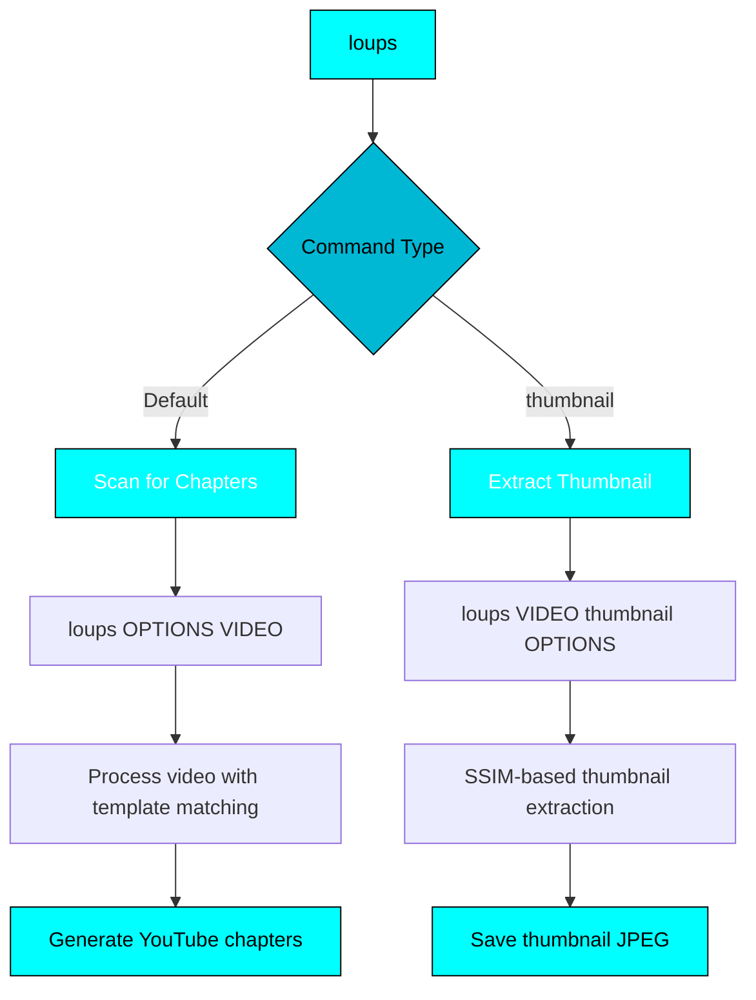

# :material-console: CLI Reference

Complete command-line interface documentation for Loups.

---

## :map: Command Structure



!!! warning "Syntax Differences"
    - **Main command:** `loups [OPTIONS] VIDEO` - Options BEFORE video
    - **Thumbnail command:** `loups VIDEO thumbnail [OPTIONS]` - Video BEFORE options

---

## :video_camera: Main Command: Chapter Scanning

Scan video for chapters using template matching and OCR.

### Syntax

```bash
loups [OPTIONS] VIDEO
```

### Required Arguments

| Argument | Description |
|----------|-------------|
| `VIDEO` | :material-file-video: Path to video file (must come AFTER options) |

### Optional Flags

#### Template & Output

| Flag | Short | Type | Description |
|------|-------|------|-------------|
| `--template PATH` | `-t` | Path | :material-palette: Template image for detection<br>**Default:** Bundled Lights Out HB template<br>**Use:** Provide custom template for any video |
| `--output PATH` | `-o` | Path | :material-content-save: Save results to file in YouTube format<br>**Format:** `HH:MM:SS Chapter Title` per line |

#### Logging & Debug

| Flag | Short | Type | Description |
|------|-------|------|-------------|
| `--log [PATH]` | `-l` | Path | :material-file-document: Enable logging<br>**Default:** `loups.log` in current directory<br>**Rotation:** 10MB max, 3 backup files |
| `--debug` | `-d` | Flag | :material-bug: Enable DEBUG level logging<br>**Requires:** `--log` flag<br>**Use:** Troubleshoot detection issues |
| `--quiet` | `-q` | Flag | :material-volume-off: Suppress progress display<br>**Note:** Errors still shown<br>**Use:** Automation/scripting |

#### Thumbnail Options (During Scan)

| Flag | Type | Description |
|------|------|-------------|
| `--extract-thumbnail` | Flag | :material-image-plus: Extract thumbnail during scan |
| `--thumbnail-template PATH` | Path | :material-image-frame: Template for thumbnail matching<br>**Default:** Uses bundled template |
| `--thumbnail-output PATH` | Path | :material-content-save: Thumbnail save location<br>**Default:** `<video>-thumbnail.jpg` |
| `--thumbnail-threshold FLOAT` | 0.0-1.0 | :material-target: SSIM similarity threshold<br>**Default:** 0.35<br>**Range:** 0.0 (loose) to 1.0 (exact) |
| `--thumbnail-scan-duration INT` | Seconds | :material-timer: Max seconds to scan from start<br>**Default:** 120 seconds |
| `--thumbnail-frames-per-second INT` | FPS | :material-image-multiple: Frame sampling rate<br>**Default:** 3 FPS |

---

### Examples

#### Basic Usage

```bash
# Use bundled template (Lights Out HB)
loups game_video.mp4

# Custom template
loups -t scoreboard.png video.mp4

# Save to file
loups -o chapters.txt video.mp4

# Custom template + save
loups -t template.png -o chapters.txt video.mp4
```

#### Logging & Debug

```bash
# Enable default logging
loups --log video.mp4

# Custom log file
loups --log /tmp/debug.log video.mp4

# Debug mode for troubleshooting
loups --log --debug video.mp4
```

#### Quiet Mode

```bash
# Suppress progress (for scripts)
loups -q -o chapters.txt video.mp4

# Combine with logging
loups -q --log --debug -o output.txt video.mp4
```

#### Combined with Thumbnail

```bash
# Extract thumbnail during scan
loups --extract-thumbnail -o chapters.txt video.mp4

# Custom thumbnail settings
loups --extract-thumbnail \
      --thumbnail-template title.png \
      --thumbnail-output thumb.jpg \
      --thumbnail-threshold 0.5 \
      -o chapters.txt \
      video.mp4
```

---

## :frame_with_picture: Thumbnail Command

Extract thumbnail using SSIM-based template matching.

### Syntax

```bash
loups VIDEO thumbnail [OPTIONS]
```

!!! info "Note the Order"
    Unlike the main command, `VIDEO` comes **BEFORE** the `thumbnail` keyword.

### Required Arguments

| Argument | Description |
|----------|-------------|
| `VIDEO` | :material-file-video: Path to video file |
| `thumbnail` | Subcommand keyword |

### Optional Flags

| Flag | Type | Description |
|------|------|-------------|
| `--thumbnail-template PATH` | Path | :material-image-frame: Template image for matching<br>**Default:** Bundled template |
| `--thumbnail-output PATH` | Path | :material-content-save: Output file path<br>**Default:** `<video>-thumbnail.jpg` in cwd |
| `--thumbnail-threshold FLOAT` | 0.0-1.0 | :material-target: SSIM similarity threshold<br>**Default:** 0.35 |
| `--thumbnail-scan-duration INT` | Seconds | :material-timer: Max seconds to scan<br>**Default:** 120 |
| `--thumbnail-frames-per-second INT` | FPS | :material-image-multiple: Frame sampling rate<br>**Default:** 3 |
| `--quiet` | Flag | :material-volume-off: Suppress output |

---

### Examples

#### Basic Thumbnail Extraction

```bash
# Use default settings
loups video.mp4 thumbnail

# Custom output location
loups video.mp4 thumbnail --thumbnail-output ./thumbnails/game1.jpg

# Custom template
loups video.mp4 thumbnail --thumbnail-template title_screen.png
```

#### Advanced Thumbnail Settings

```bash
# Stricter matching (higher threshold)
loups video.mp4 thumbnail --thumbnail-threshold 0.7

# Scan longer duration
loups video.mp4 thumbnail --thumbnail-scan-duration 300

# Sample more frames per second
loups video.mp4 thumbnail --thumbnail-frames-per-second 5
```

#### Batch Thumbnail Extraction

```bash
# Process multiple videos
for video in *.mp4; do
  loups "$video" thumbnail --thumbnail-output "thumbs/${video%.mp4}.jpg"
done
```

---

## :bulb: Tips & Best Practices

### Option Order

!!! success "Correct Order"
    ```bash
    loups [OPTIONS] VIDEO          # Main command
    loups VIDEO thumbnail [OPTIONS] # Thumbnail command
    ```

!!! danger "Incorrect Order"
    ```bash
    loups VIDEO [OPTIONS]           # Won't work!
    loups thumbnail VIDEO [OPTIONS] # Won't work!
    ```

### Template Quality

!!! tip "Good Templates"
    - :material-check: High contrast, clear text
    - :material-check: Consistent position in video
    - :material-check: No motion blur
    - :material-check: Tightly cropped around target

!!! warning "Poor Templates"
    - :material-close: Blurry or low resolution
    - :material-close: Includes moving elements
    - :material-close: Too large (includes extra regions)
    - :material-close: Inconsistent across video

### Logging Strategies

=== ":material-bug: Troubleshooting"
    ```bash
    # Full debug logging
    loups --log debug.log --debug -t template.png video.mp4

    # Check the log
    tail -f debug.log
    ```

=== ":material-cog: Production"
    ```bash
    # Quiet mode, log errors only
    loups -q --log errors.log video.mp4
    ```

=== ":material-robot: Automation"
    ```bash
    # Minimal output, errors to log
    loups -q --log /var/log/loups.log -o output.txt video.mp4
    ```

---

## :material-exit-to-app: Exit Codes

| Code | Meaning |
|------|---------|
| `0` | :material-check-circle: Success |
| `1` | :material-close-circle: Error occurred |
| `2` | :material-alert-circle: Invalid arguments |

Use in scripts:

```bash
if loups -q -o chapters.txt video.mp4; then
  echo "Success!"
else
  echo "Failed with exit code $?"
fi
```

---

## :link: Related Pages

- [:material-rocket-launch: Quick Start](quick-start.md) - Get started quickly
- [:material-palette: Custom Templates](custom-templates.md) - Create templates
- [:material-code-braces: API Reference](../api/index.md) - Programmatic usage
